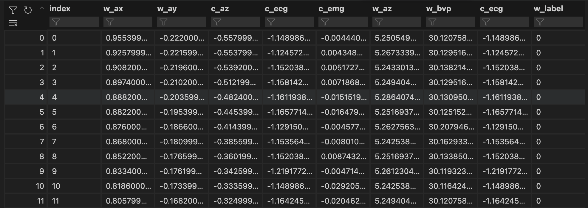

# How to run the code
#### download Biometrics for stress monitoring dataset here:
https://www.kaggle.com/datasets/qiriro/stress

#### create a new usd_team5 python environment
conda create --name usd_team5 python=3.8

#### activate new environment
conda activate usd_team5

#### install packages
pip install -r requirements.txt

#### change data_set variable in stress_detection.ipynb file to the path where WESAD is downloaded:
data_set = r"/Users/hamidhooshmandi/Downloads/WESAD/S2"

# sample data

# data description 
1. w_ax (Wrist Accelerometer X-axis):
    1. Interpretation: Measure of wrist movement on the X-axis.
    2. Real-World Range: Typically between -2.0 and 2.0 (m/s²).
    3. Example: Detecting wrist movements during typing; a value of 1.5 indicates rapid typing, -1.0 represents a sudden stop.
2. w_ay (Wrist Accelerometer Y-axis):
    1. Interpretation: Measure of arm movement on the Y-axis.
    2. Real-World Range: Typically between -2.0 and 2.0 (m/s²).
    3. Example: Arm at rest or slightly lifted; -0.5 signifies a stable arm, -1.8 suggests rapid, erratic movements.
3. c_az (Chest Accelerometer Z-axis):
    1. Interpretation: Measure of chest movement on the Z-axis.
    2. Real-World Range: Typically between -5.0 and 5.0 (m/s²).
    3. Example: Monitoring breathing patterns; -4.5 indicates deep inhalation, 4.0 suggests forceful exhalation.
4. c_ecg (Chest Electrocardiogram):
    1. Interpretation: Electrical activity of the heart.
    2. Real-World Range: Typically between -2.0 and 2.0 (mV).
    3. Example: Observing heart rhythm at rest; -0.5 represents a calm heartbeat, -1.8 indicates a rapid, irregular heartbeat.
5. c_emg (Chest Electromyography):
    1. Interpretation: Electrical activity of chest muscles.
    2. Real-World Range: Typically between -5.0 and 5.0 (mV).
    3. Example: Detecting muscle tension; -4.5 signifies significant muscle contraction, 0.2 represents relaxed muscles.
6. w_az (Wrist Accelerometer Z-axis):
    1. Interpretation: Measure of wrist rotation on the Z-axis.
    2. Real-World Range: Typically between -2.0 and 2.0 (m/s²).
    3. Example: Tracking wrist rotation; 1.0 indicates a moderate twist, -2.0 suggests an extreme, full rotation.
7. w_bvp (Wrist Blood Volume Pulse):
    1. Interpretation: Measure of blood flow, indicative of heart rate.
    2. Real-World Range: Typically between 30 and 150 (bpm).
    3. Example: Measuring heart rate variability; 140 reflects a high-stress situation, 60 indicates a very relaxed state.
8. w_label (Label):
    1. Interpretation: Binary classification label (0 for no stress, 1 for stress).
    2. Real-World Range: Binary (0, 1).
    3. Example: Labeling data for stress detection; 0 represents no stress, 1 signifies high-stress situations.

# simple statistical operations:
    1. w_ax:
        a. Mean: Calculate the average wrist movement on the X-axis.
    2. w_ay:
        a. Standard Deviation: Measure the variation in arm movement on the Y-axis.
    3. c_az:
        a. Minimum and Maximum: Identify the range of chest movement on the Z-axis.
    4. c_ecg:
        a. Median: Find the middle value of heart electrical activity.
    5. c_emg:
        a. Standard Deviation: Assess the variability in chest muscle activity.
    6. w_az:
        a. Mean: Calculate the average wrist rotation on the Z-axis.
    7. w_bvp:
        a. Percentiles: Determine the 25th and 75th percentiles of wrist blood volume pulse for distribution insights.
    8. w_label:
        a. Count: Count the occurrences of each label (0 and 1) for stress detection analysis.

# potential use cases:
1. Stress Prediction Model:
    • Develop a stress prediction model based on HRV and EDA features. Use machine learning techniques to predict stress levels or classify stress states.
2. Exploratory Data Analysis (EDA):
    • Explore the relationships between HRV, EDA, and stress levels through visualization and statistical analysis.
    • Identify patterns or trends that could inform your stress prediction model.
3. Model Evaluation:
    • Evaluate the performance of different machine learning models for stress prediction, such as decision trees, random forests, support vector machines, or neural networks.
